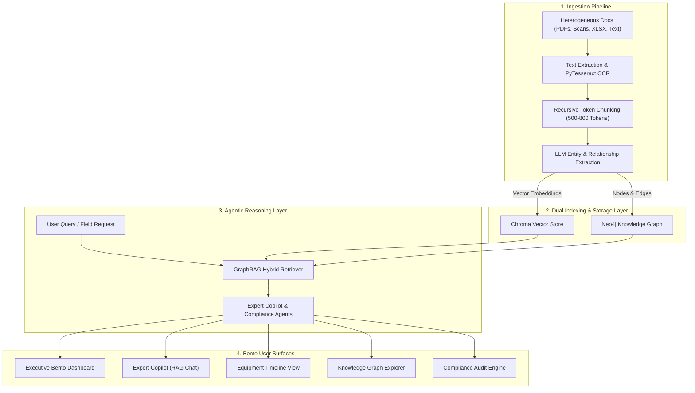

# ⚙️ PlantBrain — Unified Asset & Operations Knowledge Intelligence Platform

**ET AI Hackathon 2026 — Problem Statement 8 of 8: AI for Industrial Knowledge Intelligence**

[](https://fastapi.tiangolo.com/)
[](https://reactjs.org/)
[](https://neo4j.com/)
[](https://www.trychroma.com/)
[](https://tailwindcss.com/)
[](./PlantBrain_Presentation.pptx)

---

## 📌 Executive Summary

**PlantBrain** is a single knowledge intelligence layer that connects fragmented, multi-system plant documentation (PDFs, scanned inspection reports, work orders, P&IDs, OEM manuals, regulatory filings) into a living, queryable **Knowledge Graph**. 

By pairing **Graph-Augmented Generation (GraphRAG)** with a multimodal ingestion pipeline, PlantBrain empowers engineers and field technicians to surface zero-hallucination answers, cross-document failure patterns, and instant regulatory gap audits in seconds.

---

## 🚨 The Problem

Modern asset-intensive manufacturing plants (steel mills, refineries, power plants, chemical units) face an immense operational knowledge crisis:

- **7 to 12 Disconnected Document Silos**: Operating procedures, work orders, OEM manuals, near-miss reports, and regulatory standards sit in separate, unindexed folders and physical filing cabinets.
- **35% Engineer Time Lost**: Plant engineers lose ~35% of daily shift hours manually hunting through static PDFs and paper logs.
- **18–22% Unplanned Downtime**: Repeated equipment outages occur because teams lack cross-document context from past incidents.
- **Retiring Senior Workforce**: 25% of experienced plant engineers are retiring over the next decade, taking decades of tacit operational memory with them.

---

## ✨ Key Platform Features

| Feature | Description |
|---|---|
| 🎛️ **Bento Executive Dashboard** | Real-time coverage metrics, proactive anomaly pattern banners, live graph entity counts, and query telemetry. |
| 🤖 **Expert Copilot (GraphRAG)** | Natural language Q&A backed by dual retrieval (Vector Search + Cypher Graph Traversal) with exact source document & page citations. |
| 📈 **Equipment Timeline View** | Vertical chronological event tracking across 7+ years of work orders, maintenance logs, and near-miss reports for any equipment tag (e.g. `GB-14`). |
| 🕸️ **Knowledge Graph Explorer** | Interactive node-edge visualization allowing engineers to inspect relationships between equipment, regulations, personnel, and failure modes. |
| 🛡️ **Automated Compliance Engine** | 1-Click clause-by-clause audit of internal plant operating procedures against national regulatory standards (OISD-105, PESO, Factory Act). |
| ⚡ **Proactive Pattern Alerting** | Automatically surfaces multi-year failure signals (e.g. thermal expansion during hot work permits) *before* maintenance work begins. |

---

## 🏗️ System Architecture



---

## 💡 Innovation Differentiator: GraphRAG vs Traditional Vector RAG

| Vector RAG (Standard Competitors) | PlantBrain GraphRAG (Our Solution) |
|---|---|
| ❌ **Chunk Similarity Only**: Matches isolated paragraphs based on keyword overlap. | ✅ **Entity & Relational Traversal**: Connects Equipment (`GB-14`), Work Orders (`WO-4901`), Safety Permits (`SP-04`), and Incidents. |
| ❌ **Misses Relational Context**: Cannot link a 2019 near-miss incident report with a 2026 work order. | ✅ **Multi-Hop Graph Reasoning**: Answers complex multi-hop queries across document types. |
| ❌ **High Risk of Context Loss**: Returns fragmented text snippets. | ✅ **Proactive Pattern Alerts**: Detects 7-year recurring vibration signals prior to maintenance. |
| ❌ **Prone to Hallucinations**: Generates unverified text without verifiable anchors. | ✅ **Zero-Hallucination Guardrails**: Every claim cites exact document name, page number, and chunk. |

---

## 📂 Project Structure

```
ET_Hackathon/
├── backend/
│   ├── app/
│   │   ├── api/             # FastAPI REST endpoints (ingest, copilot, compliance, graph)
│   │   ├── core/            # Config, vector store, graph client, embedding & LLM setup
│   │   ├── models/          # Pydantic schemas & response models
│   │   ├── services/        # Ingestion service, Graph service, Agentic reasoning engines
│   │   └── main.py          # FastAPI application entrypoint & middleware
│   ├── scripts/             # Corpus seeding script (seed_corpus.py)
│   ├── Dockerfile           # Production container configuration with Tesseract OCR
│   └── requirements.txt     # Python dependencies
├── frontend/
│   ├── src/
│   │   ├── components/      # Bento grid components, Sidebar, Modals, Audio/Timeline widgets
│   │   ├── pages/           # Dashboard, Copilot, Compliance, Graph Explorer, Timeline
│   │   ├── api.ts           # Axios backend API client
│   │   └── index.css        # Custom industrial dark mode Tailwind styling
│   ├── package.json
│   └── vite.config.ts
├── data/
│   └── sample_documents/    # Synthetic & public industrial corpus (OISD, Work Orders, Incidents)
├── docs/
│   ├── demo_script.md       # 90-second video demo script & presenter guide
│   └── deployment.md        # Render & Vercel deployment documentation
├── PlantBrain_Presentation.pptx # Widescreen pitch deck presentation file
├── render.yaml              # Render deployment configuration
└── README.md
```

---

## 🚀 Quick Start & Local Setup

### Prerequisites

- **Python**: 3.10+
- **Node.js**: 18+ & `npm`
- **Tesseract OCR** (Optional for local scanned PDF OCR): `apt-get install tesseract-ocr` or Windows installer.
- **API Keys**: OpenAI or Anthropic API Key (configured in `backend/.env`).

---

### 1. Backend Setup (FastAPI)

```bash
# Navigate to backend directory
cd backend

# Create & activate a virtual environment
python -m venv venv
# On Windows:
venv\Scripts\activate
# On Linux/macOS:
source venv/bin/activate

# Install dependencies
pip install -r requirements.txt

# Create environment file
cp .env.example .env
# Edit .env and set your OPENAI_API_KEY or ANTHROPIC_API_KEY

# Seed sample industrial corpus (populates ChromaDB & Graph)
python scripts/seed_corpus.py

# Start FastAPI server
uvicorn app.main:app --reload --port 8000
```

The backend API will run at `http://localhost:8000`.  
Swagger docs available at `http://localhost:8000/docs`.

---

### 2. Frontend Setup (React + Vite)

```bash
# Open a new terminal and navigate to frontend directory
cd frontend

# Install Node dependencies
npm install

# Start Vite development server
npm run dev
```

The frontend will run at `http://localhost:5173`.

---

## 📊 Quantified Business Impact & ROI

- ⚡ **80% Reduction in Search Time**: Down from 45 minutes of manual file searching to < 5 seconds of cited copilot Q&A.
- 🛠️ **18–22% Lower Unplanned Downtime**: Early GraphRAG pattern detection catches cross-equipment failure signatures early.
- 🛡️ **100% Regulatory Audit Readiness**: Continuous automated gap analysis against OISD-105 & Factory Act standards.
- 🎓 **10x Accelerated Onboarding**: Junior technicians access 20+ years of institutional plant memory from day one on mobile.

---

## 📢 Presentation & Resources

- **PowerPoint Presentation Deck**: Download [`PlantBrain_Presentation.pptx`](./PlantBrain_Presentation.pptx)
- **Demo Script**: [`docs/demo_script.md`](./docs/demo_script.md)
- **Deployment Guide**: [`docs/deployment.md`](./docs/deployment.md)

---

## 🤝 License & Acknowledgments

Developed for the **ET AI Hackathon 2026** (Problem Statement 8: AI for Industrial Knowledge Intelligence).
